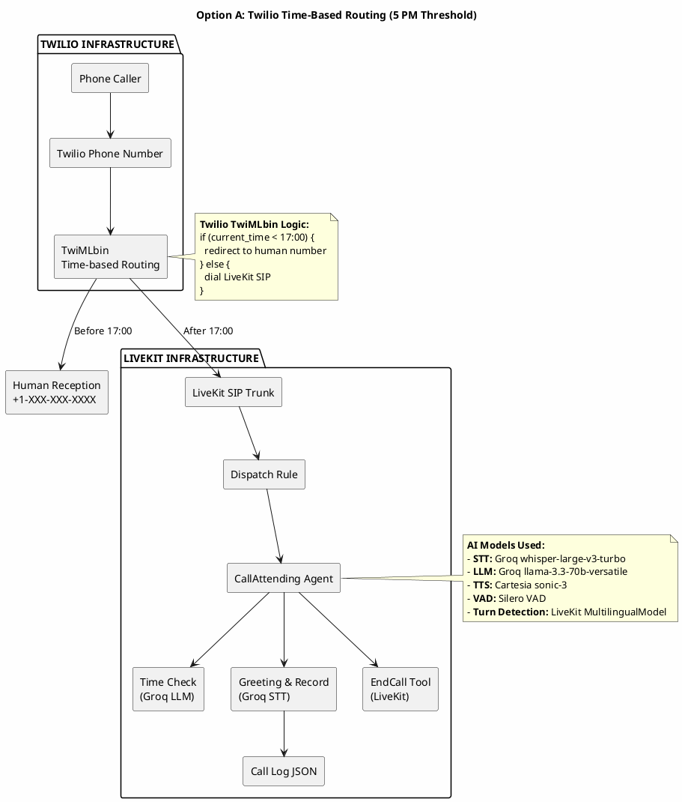

# Call Attending Agent Architecture

This document describes the architecture for handling inbound phone calls with time-based routing using Twilio and LiveKit infrastructure.

## AI Models Used

The following AI models are used in both architecture options:

| Component | Model | Provider |
|-----------|-------|----------|
| **Speech-to-Text (STT)** | `whisper-large-v3-turbo` | Groq |
| **Language Model (LLM)** | `llama-3.3-70b-versatile` | Groq |
| **Text-to-Speech (TTS)** | `sonic-3` | Cartesia |
| **Voice Activity Detection** | `silero-vad` | Silero |
| **Turn Detection** | `MultilingualModel` | LiveKit |

---

## Option A: Twilio Time-Based Routing (Recommended)

In this approach, Twilio handles time-based routing at the edge using TwiMLbin logic. Calls received before 5 PM are redirected to a human phone number, while after-hours calls are routed to the LiveKit AI agent.

### ASCII Diagram

```
┌─────────────────────────────────────────────────────────────────────────────────┐
│                              TWILIO INFRASTRUCTURE                               │
│                                                                                  │
│  ┌─────────────────┐     ┌──────────────┐     ┌─────────────────────────────┐    │
│  │  Phone Caller   │────▶│ Twilio Phone │────▶│       TwiMLbin              │    │
│  │                 │     │    Number    │     │  (Time-based Routing Logic) │    │
│  └─────────────────┘     └──────────────┘     └─────────────────────────────┘    │
│                                                          │                       │
│                              ┌───────────────────────────┴───────────┐           │
│                              │           (Before 17:00?)              │           │
│                              └───────────────────┬───────────────────┘           │
│                                                  │                               │
│                              ┌───────────────────┴───────────────────┐           │
│                              ▼                                       ▼           │
│                    ┌─────────────────┐                  ┌──────────────┐          │
│                    │  Redirect to    │                  │  LiveKit SIP │          │
│                    │ Human Reception │                  │   Trunk    │          │
│                    │  +1-XXX-XXX-XXXX│                  └──────┬───────┘          │
│                    └─────────────────┘                         │                │
│                                                                  │                │
└──────────────────────────────────────────────────────────────────┼────────────────┘
                                                                   │
┌──────────────────────────────────────────────────────────────────┼────────────────┐
│                           LIVEKIT INFRASTRUCTURE                 │                │
│                                                                  │                │
│                              ┌───────────────────────────────────┘                │
│                              ▼                                                    │
│                       ┌──────────────┐                                             │
│                       │ Dispatch Rule│                                             │
│                       │   (SIP)      │                                             │
│                       └──────┬───────┘                                             │
│                              │                                                    │
│                              ▼                                                    │
│                       ┌──────────────┐                                              │
│                       │CallAttending │                                              │
│                       │    Agent     │                                              │
│                       └──────┬───────┘                                              │
│                              │                                                      │
│              ┌───────────────┼───────────────┐                                      │
│              ▼               ▼               ▼                                      │
│        ┌──────────┐    ┌──────────┐    ┌──────────┐                                 │
│        │ Time     │    │ Greeting │    │ EndCall  │                                 │
│        │ Check    │    │ & Record │    │   Tool   │                                 │
│        │(Groq LLM)│    │(Groq STT)│    │(LiveKit) │                                 │
│        └──────────┘    └──────────┘    └──────────┘                                 │
│                              │                                                      │
│                              ▼                                                      │
│                       ┌──────────────┐                                              │
│                       │  Call Log    │                                              │
│                       │  JSON File   │                                              │
│                       └──────────────┘                                              │
│                                                                                     │
└─────────────────────────────────────────────────────────────────────────────────────┘

Legend:
┌─────────────────────────────────────────────────────────────┐
│  Models:                                                    │
│  • STT: Groq whisper-large-v3-turbo                         │
│  • LLM: Groq llama-3.3-70b-versatile                        │
│  • TTS: Cartesia sonic-3                                    │
│  • VAD: Silero VAD                                          │
│  • Turn Detection: LiveKit MultilingualModel                 │
└─────────────────────────────────────────────────────────────┘
```

### PlantUML Code



---

## Option B: LiveKit Time-Based Routing (Current Implementation)

In this approach, all calls are routed through Twilio to LiveKit, and the LiveKit agent handles time-based filtering. Calls before 5 PM are politely declined by the AI agent.

### ASCII Diagram

```
┌─────────────────────────────────────────────────────────────────────────────────┐
│                              TWILIO INFRASTRUCTURE                               │
│                                                                                  │
│  ┌─────────────────┐     ┌──────────────┐     ┌─────────────────────────────┐    │
│  │  Phone Caller   │────▶│ Twilio Phone │────▶│       TwiMLbin              │    │
│  │                 │     │    Number    │     │   (Direct SIP Dial)         │    │
│  └─────────────────┘     └──────────────┘     └─────────────────────────────┘    │
│                                                          │                       │
│                                                          │                       │
│                                                          ▼                       │
│                                                  ┌──────────────┐                │
│                                                  │  LiveKit SIP │                │
│                                                  │    Trunk     │                │
│                                                  └──────┬───────┘                │
│                                                         │                        │
└─────────────────────────────────────────────────────────┼────────────────────────┘
                                                          │
┌─────────────────────────────────────────────────────────┼────────────────────────┐
│                           LIVEKIT INFRASTRUCTURE        │                        │
│                                                         │                        │
│                              ┌──────────────────────────┘                        │
│                              ▼                                                    │
│                       ┌──────────────┐                                             │
│                       │ Dispatch Rule│                                             │
│                       │   (SIP)      │                                             │
│                       └──────┬───────┘                                             │
│                              │                                                    │
│                              ▼                                                    │
│                       ┌──────────────┐                                              │
│                       │CallAttending │                                              │
│                       │    Agent     │                                              │
│                       └──────┬───────┘                                              │
│                              │                                                      │
│              ┌───────────────┼───────────────┐                                      │
│              ▼               ▼               ▼                                      │
│        ┌──────────┐    ┌──────────┐    ┌──────────┐                                 │
│        │ Time     │    │ Greeting │    │ EndCall  │                                 │
│        │ Check    │    │ & Record │    │   Tool   │                                 │
│        │(17:00    │    │(Groq STT)│    │(LiveKit) │                                 │
│        │threshold)│    │ Cartesia │    │          │                                 │
│        │(Groq LLM)│    │ TTS      │    │          │                                 │
│        └─────┬────┘    └────┬─────┘    └────┬─────┘                                 │
│              │              │               │                                       │
│              │              ▼               │                                       │
│              │       ┌──────────────┐      │                                       │
│              │       │  Call Log    │◄─────┘                                       │
│              │       │  JSON File   │                                                │
│              │       └──────────────┘                                                │
│              │                                                                        │
│              ▼                                                                        │
│   ┌─────────────────────┐                                                            │
│   │  Polite Decline     │                                                            │
│   │ "Office is open,    │                                                            │
│   │  call back later"   │                                                            │
│   │  (Cartesia TTS)     │                                                            │
│   └─────────────────────┘                                                            │
│                                                                                       │
└───────────────────────────────────────────────────────────────────────────────────────┘

Legend:
┌─────────────────────────────────────────────────────────────┐
│  Models:                                                    │
│  • STT: Groq whisper-large-v3-turbo                         │
│  • LLM: Groq llama-3.3-70b-versatile                        │
│  • TTS: Cartesia sonic-3                                    │
│  • VAD: Silero VAD                                          │
│  • Turn Detection: LiveKit MultilingualModel                 │
└─────────────────────────────────────────────────────────────┘
```

### PlantUML Code

```plantuml
@startuml
!define RECTANGLE class

skinparam backgroundColor #FEFEFE
skinparam componentStyle rectangle

title Option B: LiveKit Time-Based Routing (5 PM Threshold)

package "TWILIO INFRASTRUCTURE" {
    [Phone Caller] as Caller
    [Twilio Phone Number] as TwilioNumber
    [TwiMLbin\nDirect SIP Dial] as TwiMLbin
    
    Caller --> TwilioNumber
    TwilioNumber --> TwiMLbin
    TwiMLbin --> [LiveKit SIP Trunk] as SIPTrunk
}

package "LIVEKIT INFRASTRUCTURE" {
    [Dispatch Rule] as DispatchRule
    [CallAttending Agent] as Agent
    
    [Time Check\n17:00 Threshold\nGroq LLM] as TimeCheck
    [Greeting & Record\nGroq STT + Cartesia TTS] as Greeting
    [EndCall Tool\nLiveKit] as EndCall
    [Call Log JSON] as CallLog
    [Polite Decline\nCartesia TTS] as Decline
    
    SIPTrunk --> DispatchRule
    DispatchRule --> Agent
    Agent --> TimeCheck
    TimeCheck --> Greeting : After 17:00
    TimeCheck --> Decline : Before 17:00
    Greeting --> CallLog
    Greeting --> EndCall
}

note right of TimeCheck
  **LiveKit Agent Time Check:**
  if (current_hour >= 17) {
    accept call (after hours)
  } else {
    decline call (office open)
  }
end note

note right of Agent
  **AI Models Used:**
  - **STT:** Groq whisper-large-v3-turbo
  - **LLM:** Groq llama-3.3-70b-versatile
  - **TTS:** Cartesia sonic-3
  - **VAD:** Silero VAD
  - **Turn Detection:** LiveKit MultilingualModel
end note

@enduml
```

---

## Comparison

| Aspect | Option A (Twilio Routing) | Option B (LiveKit Routing) |
|--------|---------------------------|----------------------------|
| **Time Check Location** | Twilio TwiMLbin (edge) | LiveKit Agent (server) |
| **Before 5 PM Calls** | Redirected to human number | Handled by AI, politely declined |
| **Cost Efficiency** | Lower (no LiveKit charges for day calls) | Higher (all calls use LiveKit) |
| **Complexity** | Higher (TwiMLbin logic needed) | Lower (single agent handles all) |
| **Flexibility** | Lower (static TwiMLbin rules) | Higher (dynamic agent logic) |
| **Human Touch** | High (day calls to humans) | Low (AI handles all calls) |
| **Best For** | Businesses wanting human daytime reception | 24/7 AI-first approach |

---

## TwiMLbin Configuration

### Option A: Time-Based Routing TwiML

```xml
<?xml version="1.0" encoding="UTF-8"?>
<Response>
  <!-- Get current hour (requires server-side TwiML generation or Twilio Functions) -->
  <Gather input="speech" timeout="1" action="/check-time" />
  
  <!-- Or use Twilio Function for time check -->
  <Redirect method="POST">https://your-function.twil.io/check-time</Redirect>
</Response>
```

**Twilio Function (Node.js) for Time Check:**
```javascript
exports.handler = function(context, event, callback) {
  const twiml = new Twilio.twiml.VoiceResponse();
  const hour = new Date().getHours();
  
  if (hour < 17) {
    // Before 5 PM - redirect to human
    twiml.dial('+1-XXX-XXX-XXXX');
  } else {
    // After 5 PM - route to LiveKit AI
    twiml.dial({
      callerId: event.From
    }).sip({
      username: '<sip_trunk_username>',
      password: '<sip_trunk_password>'
    }, 'sip:<phone_number>@<livekit-sip-endpoint>;transport=tcp');
  }
  
  callback(null, twiml);
};
```

### Option B: Direct SIP Dial TwiML

```xml
<?xml version="1.0" encoding="UTF-8"?>
<Response>
  <Dial>
    <Sip username="<sip_trunk_username>" password="<sip_trunk_password>">
      sip:<your_phone_number_puchased_from_twilio>@<your LiveKit SIP endpoint>;transport=tcp
    </Sip>
  </Dial>
</Response>
```

---

## Environment Variables

```env
# LiveKit Server Credentials
LIVEKIT_URL=wss://your-project.livekit.cloud
LIVEKIT_API_KEY=your-api-key
LIVEKIT_API_SECRET=your-api-secret

# Groq API (STT and LLM)
GROQ_API_KEY=gsk_your-groq-api-key

# Cartesia API (TTS)
CARTESIA_API_KEY=sk_car_your-cartesia-key

# Model Configuration
GROQ_LLM_MODEL=llama-3.3-70b-versatile
GROQ_STT_MODEL=whisper-large-v3-turbo
CARTESIA_TTS_MODEL=sonic-3
CARTESIA_TTS_VOICE=9626c31c-bec5-4cca-baa8-f8ba9e84c8bc

# Time Threshold (17 = 5 PM)
CALL_ATTEND_AFTER_HOUR=17

# Option A: Human reception number for daytime calls
HUMAN_RECEPTION_NUMBER=+1-XXX-XXX-XXXX